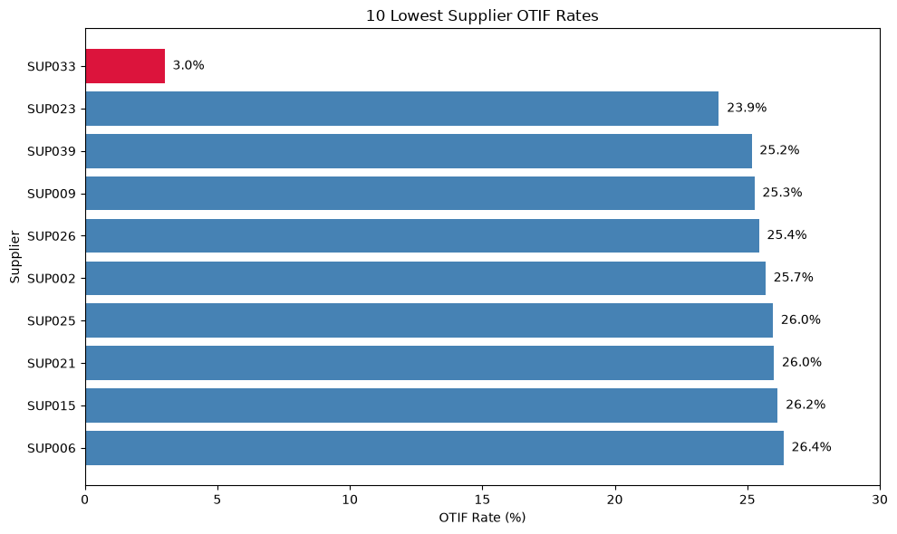
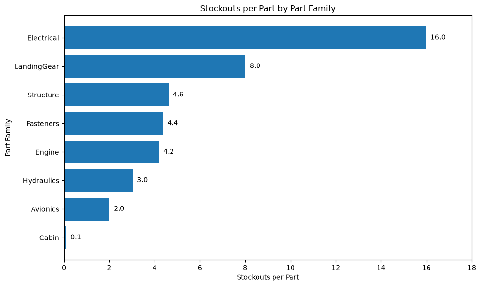
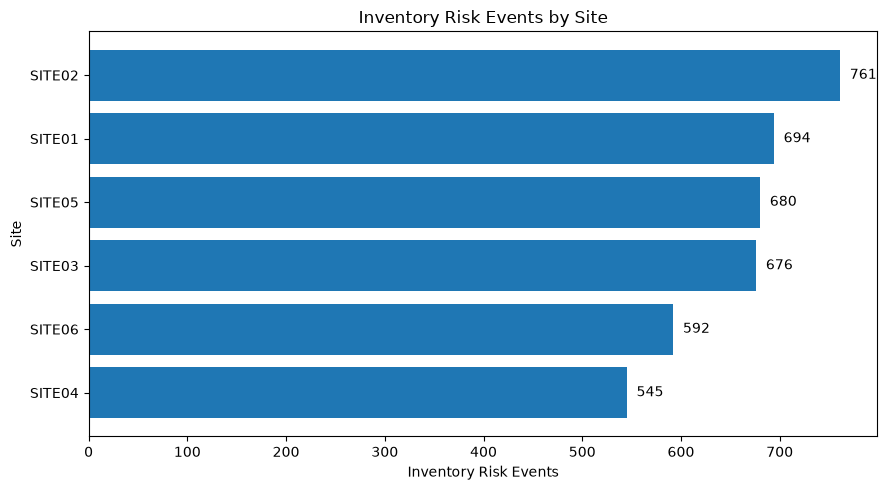
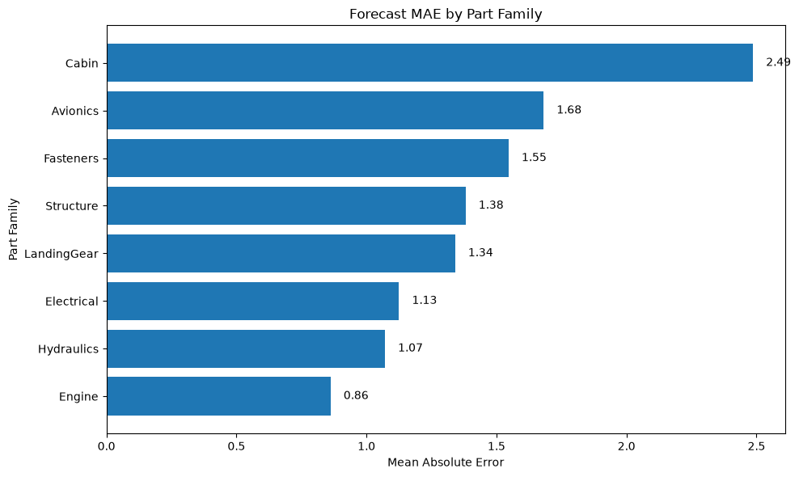
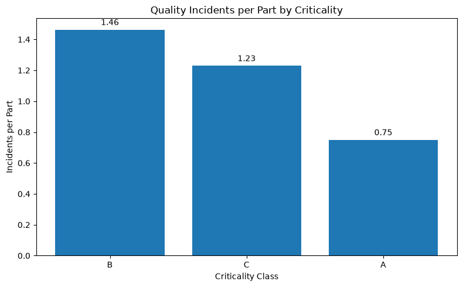

# AeroFlow Supply Chain Analytics

## Project Overview

AeroFlow is a supply chain analytics project focused on identifying operational risk across supplier performance, inventory availability, demand forecasting and quality.

Using Python and pandas, the project profiles, cleans and analyses supply chain data before communicating the strongest findings through Matplotlib visualisations. The objective is to move beyond KPI reporting and identify where performance issues are concentrated, what is driving them and where management action should be prioritised.

## Business Problem

AeroFlow manages a complex supply chain involving multiple suppliers, sites and part families. Performance issues such as late deliveries, stockouts, backorders, forecast error and quality incidents can disrupt operations and increase supply risk.

The analysis was designed to answer four key business questions:

- Which suppliers present the greatest delivery and quality risk?
- Where are stockouts and backorders most concentrated?
- Which parts and sites are hardest to forecast accurately?
- Which part groups carry the highest relative quality burden?

The findings are used to develop targeted recommendations for Procurement, Inventory Control, Demand Planning and Quality teams.

## Tools Used

- **Python** — data analysis and transformation
- **pandas** — data cleaning, aggregation, joins and KPI calculations
- **Matplotlib** — visualisation of key operational findings
- **Jupyter Notebook** — structured analytical workflow and documentation
- **GitHub** — project version control and portfolio presentation

## Data

The analysis uses four cleaned datasets covering core supply chain activity:

- **Parts Master** — part family, criticality and supplier risk attributes
- **Purchase Orders** — supplier delivery performance, OTIF, on-time and in-full measures
- **Supply Chain History** — forecast demand, consumption, stockouts, backorders and site activity
- **Quality Incidents** — defect type, severity and scrap quantities

The cleaned data is used to analyse performance across suppliers, parts, sites and quality categories.

## Analytical Workflow

The project follows a structured end-to-end analytical workflow:

1. **Data Profiling**  
   Reviewed dataset structure, missing values, data types and initial quality issues.

2. **Data Cleaning**  
   Standardised fields, created analysis flags and prepared clean datasets for downstream analysis.

3. **Exploratory Analysis**  
   Investigated supplier reliability, inventory risk, forecast accuracy and quality performance using grouped analysis and normalised metrics.

4. **Visualisation**  
   Used Matplotlib to communicate the strongest findings and highlight operational outliers.

5. **Recommendations**  
   Converted analytical findings into targeted actions with defined owners, expected impact and metrics to track.

## Key Findings

### Supplier Performance
SUP033 was the most significant supplier-performance outlier, recording an OTIF rate of only 3.0% across 631 purchase orders. Its average delivery variance was approximately 6.1 days late, and it also recorded the highest serious quality incident rate among suppliers when normalised by order volume.

### Inventory Risk
Inventory availability risk was concentrated within Electrical parts. Electrical recorded approximately 16 stockouts per part, around twice the rate of LandingGear and substantially above the other part families. SITE02 recorded the highest combined stockout and backorder exposure.

### Forecast Accuracy
Cabin parts had the highest forecast error, with a mean absolute error of approximately 2.49 units. However, Cabin also had very low stockout exposure, indicating that forecast accuracy was not the primary driver of AeroFlow’s inventory availability issues.

### Quality Performance
Class B parts carried the highest normalised quality burden, with approximately 1.46 incidents and 1.89 scrap units per part. This showed that raw incident totals alone would have overstated the relative quality risk within Class C parts.

## Visualisations

### Supplier OTIF Performance


SUP033 is a clear outlier, with an OTIF rate of approximately 3.0%, substantially below the other weakest-performing suppliers.

### Stockouts per Part Family


Electrical parts show the highest stockout exposure at approximately 16 stockouts per part, indicating a concentrated inventory availability issue.

### Inventory Risk by Site


SITE02 records the highest combined stockout and backorder exposure, although inventory risk remains elevated across the wider site network.

### Forecast Accuracy by Part Family


Cabin parts have the highest forecast error, but this does not translate into high stockout exposure, suggesting forecasting is not the main driver of inventory risk.

### Quality Burden by Criticality


Class B parts carry the highest normalised quality burden, reinforcing the importance of using per-part measures rather than raw incident totals alone.

## Recommendations

### Priority 1 — SUP033 Supplier Recovery

**Priority:** High  
**Recommendation:** Launch a supplier recovery plan for SUP033 focused on delivery reliability, corrective actions and contingency sourcing for critical parts.  
**Owner:** Procurement / Supplier Quality  
**Expected Impact:** Improve OTIF, reduce delivery delays and lower exposure on critical parts.  
**Metric to Track:** SUP033 OTIF %, average delivery delay, serious incidents per 100 orders

### Priority 2 — Electrical Inventory Risk

**Priority:** High  
**Recommendation:** Review replenishment and safety-stock settings for Electrical parts, especially P00179, P00124, P00043 and Class A part P00062.  
**Owner:** Supply Chain Planning / Inventory Control  
**Expected Impact:** Reduce recurring stockouts and backorders in the highest-risk part family.  
**Metric to Track:** Stockouts per part, backorders per part, inventory-risk events

### Priority 3 — SITE02 Inventory Exposure

**Priority:** High  
**Recommendation:** Investigate SITE02 inventory policy and replenishment performance, with particular focus on Electrical items and Class A part P00062.  
**Owner:** Site Operations / Inventory Control  
**Expected Impact:** Reduce the site's elevated stockout and backorder exposure and improve availability of critical parts.  
**Metric to Track:** SITE02 stockout count, backorder count, inventory-risk events

### Priority 4 — Forecast Accuracy Improvement

**Priority:** Medium  
**Recommendation:** Target forecast improvement work at Cabin parts and SITE06/SITE04, where forecast error is highest. Review demand patterns and forecast assumptions before making wider forecasting changes.  
**Owner:** Demand Planning  
**Expected Impact:** Improve forecast accuracy in the areas with the greatest error while avoiding unnecessary changes where forecasting is already relatively strong.  
**Metric to Track:** MAE by part family, MAE by site

### Priority 5 — Class B Quality Improvement

**Priority:** Medium  
**Recommendation:** Prioritise Class B parts for quality improvement activity, focusing on defect prevention, root-cause analysis and scrap reduction.  
**Owner:** Quality / Engineering  
**Expected Impact:** Reduce the highest normalised quality burden across AeroFlow's criticality classes and lower avoidable scrap.  
**Metric to Track:** Quality incidents per part, scrap per part, serious incident rate

## Limitations

- The analysis is based on historical operational data and does not include external factors such as supplier capacity constraints, transport disruption or market conditions.
- Stockout and backorder analysis identifies where availability problems occur but does not directly measure the financial or production impact of each event.
- Forecast accuracy is assessed using mean absolute error, which provides a clear comparison across groups but does not capture every aspect of forecast bias or demand volatility.
- Supplier quality analysis is based on recorded incidents and may not reflect unreported or delayed quality issues.
- Recommendations are based on the available operational evidence and would require validation with relevant business stakeholders before implementation.

## Repository Structure

```text
AeroFlow/
├── Data/
│   ├── Raw/
│   └── Cleaned/
├── Images/
│   ├── supplier_otif.png
│   ├── stockouts_by_family.png
│   ├── inventory_risk_by_site.png
│   ├── forecast_mae_by_family.png
│   └── quality_by_criticality.png
├── Python/
│   ├── 01_data_profiling.ipynb
│   ├── 02_data_cleaning.ipynb
│   ├── 03_exploratory_analysis.ipynb
│   └── 04_visualisation.ipynb
├── SQL/
├── PowerBI/
├── .gitattributes
└── README.md